:data-transition-duration: 500
:css: tpopp.css

.. title: The Point of Pointless Projects

.. |twitter| image:: images/twitter.png
.. |instagram| image:: images/insta.png
.. |github| image:: images/github.png
.. |githubsmall| image:: images/github.png 
	:height: 32px
.. |githubmini| image:: images/github.png 
	:height: 16px

----

:id: first-slide

The Point of Pointless Projects
===============================

Henrik Blidh
------------

M.Sc.Eng.Math.

+------------+------------+-------------+ 
| |twitter|  | |github|   | |instagram| | 
+============+============+=============+ 
|            | **@hbldh** |             | 
+------------+------------+-------------+ 

.. note::

	Hello and welcome to this presentation called The Point of Pointless Projects.

	I am going to tell you about soem spare time programming projects of mine and from them try to extraoplate some insights about such projects in general.

	My name is Henrik Blidh, I have a Master's Degree in Engineering Mathematics and this is you you can get in touch with me later on.

----

:data-x: r3000

:id: about-slide

:class: center-slide

About me
========

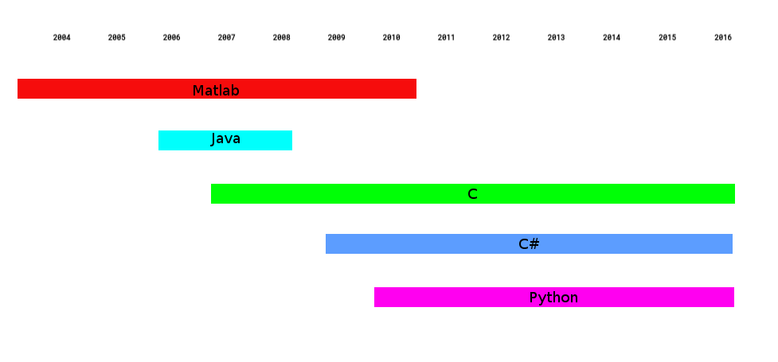

.. note::

	This is me, my programming history.

	I started out in Matlab, duing the early stages of my education.

	Later courses branched out into Java and C, but my main language was still Matlab, which I regarded as kind of a necessary evil.

	I started working in 2008, still coding in Matlab, and I was aquainted with Python first in 2010, when a newly hired employee suggested that
	we should port our code to get better maintainablility. Since I hade built a distributed computational cluster in Matlab and C# and felt that
	it was unnecessarily complex, I felt that it might be a good idea and I haven't looked back since.  

----

Introduction
============

This talk will present four years worth of spare time coding, focusing very little on the actual 
code written but rather describing both the intented and unintended effects of the coding.

.. note::
	
	This talk will present four years worth of spare time coding, focusing very little on the actual 
	code written but rather describing both the intented and unintended effects of the coding.

	Almost all projects lead to some kind of increase in knowledge, but I will not list all the 
	things I learned during the projects. If I did I would talk all day and you would find it
	tremendeously boring...

	* The true onset of my love for coding came after I started feeling comfortable with Python. 
	* I find Python exceptional in its potential for rapid development and that one can get quite a lot done in half an hour before bed or during commuting to and from work.

----

:class: center-slide

IMPORTANT!
==========

Just so we're clear: 

I love pointless projects!
--------------------------

pointless != worthless
~~~~~~~~~~~~~~~~~~~~~~

.. note::

	Just so we're clear: 

	I love pointless projects!

	pointless != worthless

----

What constitutes a pointless project?
=====================================

**N.B. this is a personal, incomplete, definition!**

Required properties
-------------------
* Little or no use to general public
* Created for either
	1) educational purposes
	2) artistical purposes
	3) lulz

Optional properties
-------------------
* Very time consuming
* Solving simple task in complex and/or complicated fashion
* Being the "wrong" way of performing the issue at hand
* Addressing aspects of an issue not often scrutinized

.. note::

	What constitutes a pointless project?
	
	N.B. this is a personal, incomplete, definition!

	* Little or no use to general public
	* Created for either
		1) educational purposes
		2) artistical purposes
		3) lulz

	* Very time consuming
	* Solving simple task in complex and/or complicated fashion
	* Being the "wrong" way of performing the issue at hand
	* Addressing aspects of an issue not often scrutinized

----

:class: center-slide

Let's look at some examples from the web!
=========================================

.. note::

	Let's look at some examples from the web.

----

:class: center-slide

@legokarlove
============

Reenacting Karl Ove Knausgård's books in Lego on Instagram.

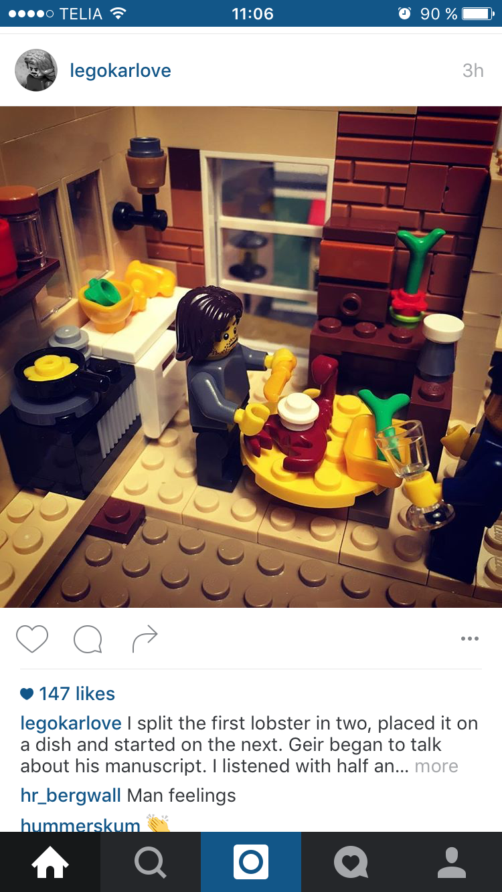

----

:class: center-slide

Brainfuck
=========

The programming language.

.. code-block:: brainfuck

	++++++++[>++++[>++>+++>+++>+<<<<-]>+>+>->>+[<]<-]>>.>---.+++++++..+++.>>.<-.<.+++.------.--------.>>+.>++.

----

:class: center-slide

The Most Useless Machine EVER!
==============================

Source: http://www.youtube.com/watch?v=Z86V_ICUCD4

----

:class: center-slide

Any Sudoku solver ever written
==============================

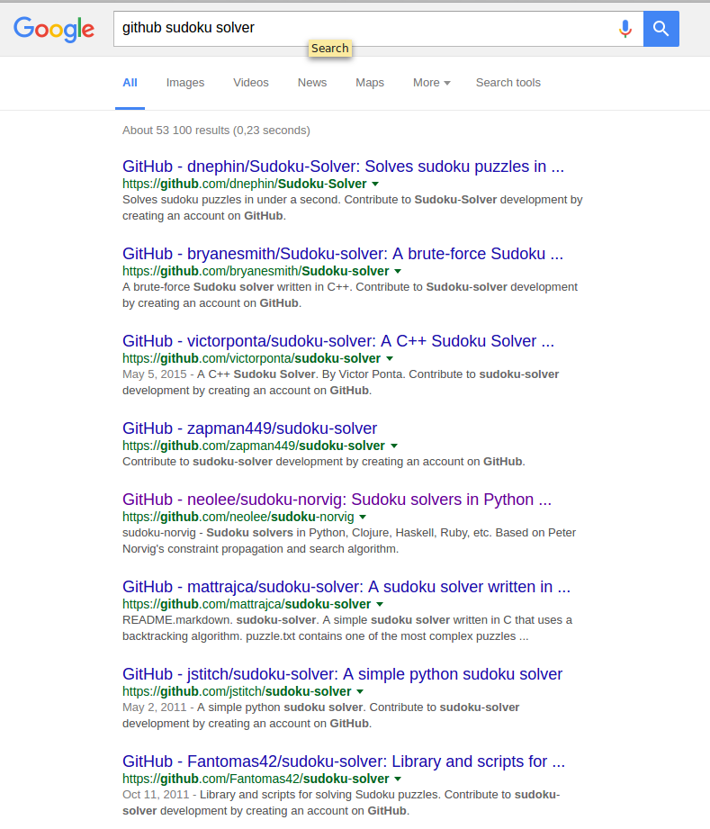

----

:class: center-slide

The Advent of My Pointless Projects
===================================

My father-in-law gave me a book of 365 Sudokus for Christmas in 2012.

I solved about three of them and thought, "This could be automated..."

.. note::

	
	The Advent of My Pointless Projects
	
	My father-in-law gave me a book of 365 Sudokus for Christmas in 2012.

	I solved about three of them and thought, "This could be automated..."

----

DLXSudoku
=========

.. note::
	
	Sudoku Solver in pure puthon, no dependencies.

	When it was done, I realised that I would never use it since I would have to enter the Sudoku to solve manually.	

|githubsmall| hbldh/dlxsudoku

.. code-block:: bash

	hbldh@devbox ~ $ solve-sudoku --sudoku "030467050920010006067300148301006027400850600090200400005624001203000504040030702"
	138|467|259
	924|518|376
	567|392|148
	---+---+---
	351|946|827
	472|851|693
	896|273|415
	---+---+---
	785|624|931
	213|789|564
	649|135|782

**Desired output:** Sudoku Solver

**Unexpected output:** 
	
	* |githubmini| ``hbldh/sudokuextract`` - Package for extracting Sudokus from images using ``scikit-image``.

----

:class: center-image

SudokuExtract
=============

|githubsmall| hbldh/sudokuextract

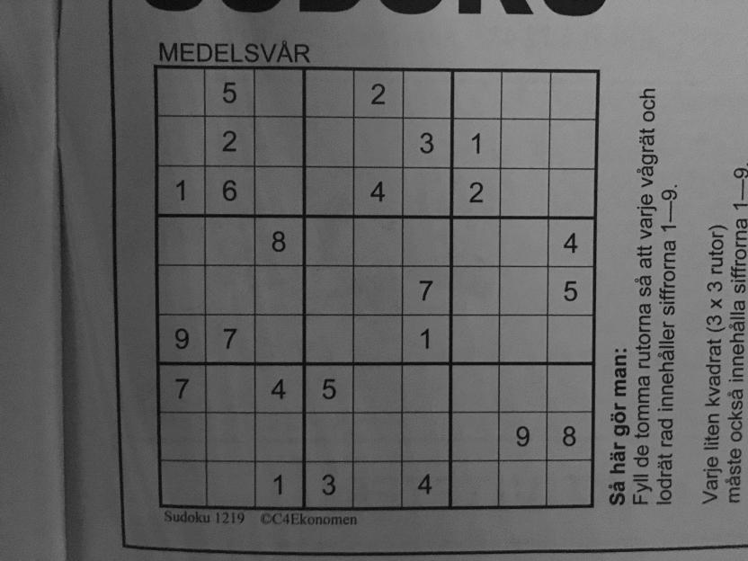

----

:class: center-image

SudokuExtract
=============

|githubsmall| hbldh/sudokuextract

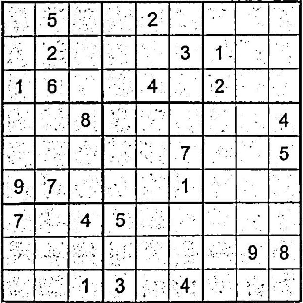

----

:class: center-image

SudokuExtract
=============

|githubsmall| hbldh/sudokuextract

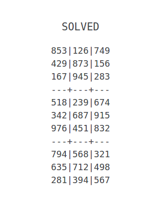

----

SudokuExtract
=============

.. note::
	
	The idea: 
		
		- Using scikit-image (since opencv for Python complicated to install)

		- Needs some OCR solution for detecting digits.

	After doing some failed tests with Tesseract I decided to do it myself.

	Read some papers. Decided on Elliptical Fourier Descriptors and Machine Learning.

	
|githubsmall| hbldh/sudokuextract

.. code-block:: bash

	hbldh@devbox ~ $ parse-sudoku --oneliner -p sudoku.jpg > /tmp/sudoku.txt && solve-sudoku --path /tmp/sudoku.txt && rm /tmp/sudoku.txt
	853|126|749
	429|873|156
	167|945|283
	---+---+---
	518|239|674
	342|687|915
	976|451|832
	---+---+---
	794|568|321
	635|712|498
	281|394|567

**Desired output:** Sudoku Image Parser

**Unexpected output:** 
	
	* |githubmini| ``hbldh/pyefd`` - Elliptical Fourier Descriptors package 

----

:class: center-image

Elliptical Fourier Descriptors
==============================

|githubsmall| hbldh/pyefd

`Frank P Kuhl, Charles R Giardina, Elliptic Fourier features of a closed contour,
Computer Graphics and Image Processing, Volume 18, Issue 3, 1982, Pages 236-258 <http://www.sci.utah.edu/~gerig/CS7960-S2010/handouts/Kuhl-Giardina-CGIP1982.pdf>`_

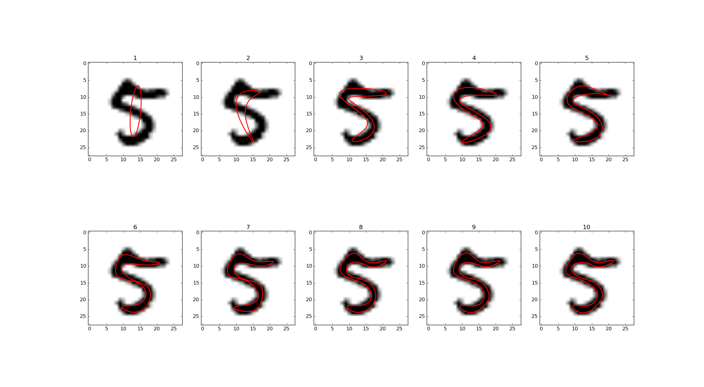

Data from: `LeCun et al. (1999): The MNIST Dataset Of Handwritten Digits <http://yann.lecun.com/exdb/mnist/>`_

.. note::
	
	I did not find any good implementation of EFD online, so I wrote one.

	EFD provides a means of representing a contour by an array of numbers, providing the means of applying a machine learning solution for classifying images into different digits.

----

SudokuExtract
=============

.. note::
	
	It works decently well. I still haven't been able to handle photos of Sudokus on computer screens.

	When this was done I realised that I would never use it since I would never have the energy to take a photo, save it to disk and run a command line tool on it just to solve a Sudoku

|githubsmall| hbldh/sudokuextract

.. code-block:: bash

	hbldh@devbox ~ $ parse-sudoku --oneliner -p sudoku.jpg > /tmp/sudoku.txt && solve-sudoku --path /tmp/sudoku.txt && rm /tmp/sudoku.txt
	853|126|749
	429|873|156
	167|945|283
	---+---+---
	518|239|674
	342|687|915
	976|451|832
	---+---+---
	794|568|321
	635|712|498
	281|394|567

**Desired output:** Sudoku Image Parser

**Unexpected output:** 
	
	* |githubmini| ``hbldh/xanadoku`` - Web interface for solving Sudokus...

----

:class: center-image

Xanadoku
========

|githubsmall| hbldh/xanadoku

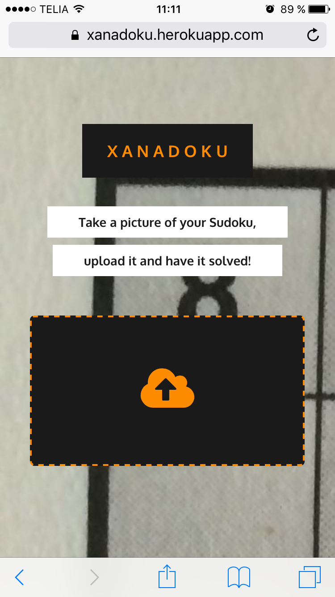
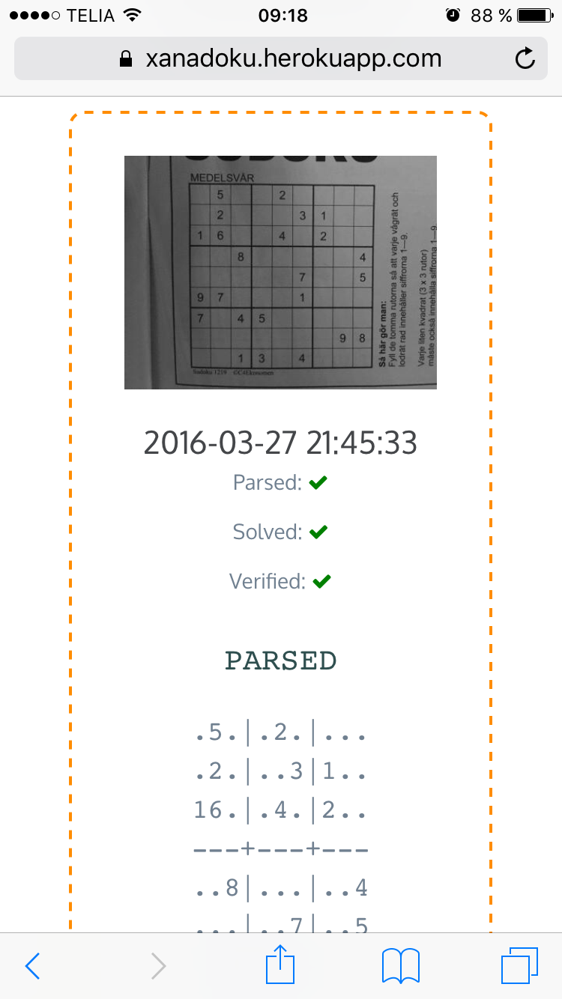

+-------+-------+
| |x1|  |  |x2| |
+=======+=======+
|       |       |
+-------+-------+

**Desired output:** Sudoku Solver Web application

**Unexpected output:** None

----

:class: center-slide

The Sudoku project chain is at an end
=====================================

Let's move on to something else...

----

:class: center-slide

BankID
======

At work I got an assignment to do a ASP.NET project using BankID signing.

BankID applications behave differently on iOS, Android, Safari, Chrome, etc. 

I wanted to examine this closer.

.. note::
	
	- At work I got an assignment to do a ASP.NET project using BankID signing.

	- BankID mobile applications behave different when called on iOS and Android, from Safari and Chrome, etc.

	- After the assignment was completed I wanted to explore more closely how these things interacted, but I felt like it would take to long to do with C#.

Solution: Python.

----

BankID exploration project
==========================

|githubsmall| hbldh/pybankid-example-app

.. code-block:: python

	>>> from bankid import BankIDClient
	>>> client = BankIDClient(certificates=('path/to/certificate.pem', 'path/to/key.pem'))

.. note::
	
	- I started writing the example app.
	
	- Turned out no one written anything for BankID in Python, so I did it myself.

	- Eventually it turned out that the bankid client became a useful, standalone component.

	- The standalone component was more fun to write so I did that instead.

	- SOAP, uses Suds.

	- I also made a Flask extension of it.

	- The example app behaviour exploration never really got done though...

**Desired output:** Flask web application for exploring use of BankID.

**Unexpected output:** 

	* |githubmini| ``hbldh/pybankid`` - BankID client for Python.
	* |githubmini| ``hbldh/flask-pybankid`` - Flask Extension for PyBankID client.

----

:class: center-slide

Curiosity killed the cat...
===========================

The BankID thing had a pretty decent project fallout, right?

Let's look at a more loosly defined project...

.. note::

	The BankID thing had a pretty decent project fallout, right?

	Let's look at a more loosly defined project...

----

:class: center-slide

"I want to measure power" 
=========================

A friend of mine asked me "How would I go about measuring the output power when I lift weights?"

Prototype time...

.. note ::
	
	Since I have been working with accelerometers and gyroscopes for some years I started prototyping...

----

:class: center-slide

Raspberry Pi + BerryIMU
=======================

.. note ::
	
	I bought a Raspberry Pi, a small IMU unit and a power pack...

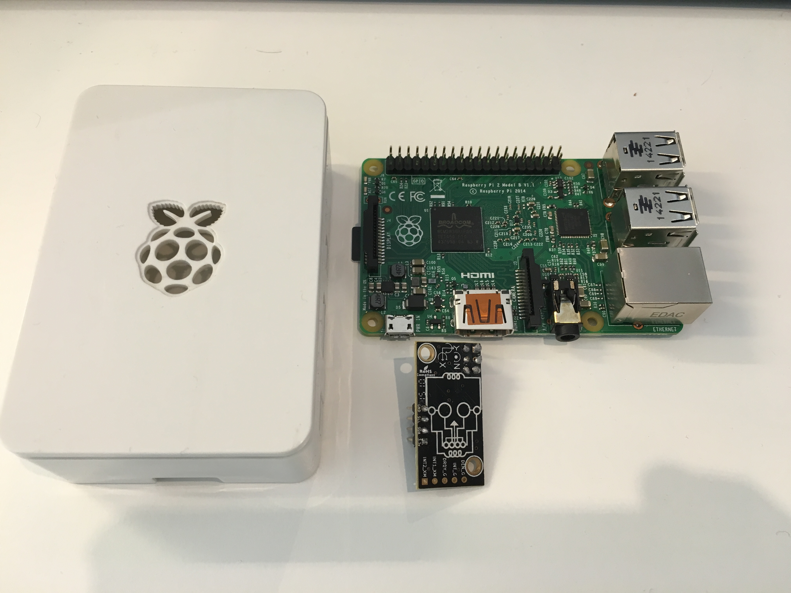

----

PyBerryIMU
==========

.. note ::
	
	I then built a Python package for recording data with it.

	* The accelerometer needed calibration. I read some papers and implemented a method I liked. This worked so well that I broke it out as a separate package.

	* My friend who was going to use it is not a programmer. I made a web interface for him and any other potential interested party.

|githubsmall| hbldh/pyberryimu

**Desired output:** Python client for BerryIMU.

**Unexpected output:** 

	* |githubmini| ``hbldh/calibraxis`` - Implementation of accelerometer autocalibration method.
	* |githubmini| ``hbldh/pyberryimu-rest`` - Web interface for initiating recording.

----

:class: center-slide

Ok, but strapping a Raspberry Pi to a barbell isn't very practical is it?
=========================================================================

----

MetaWear
========

I backed two projects on Kickstarter during the prototype stage, so when I was done with the Raspberry stuff these little Bluetooth Low Energy sensor board beauties arrived on my doorstep!

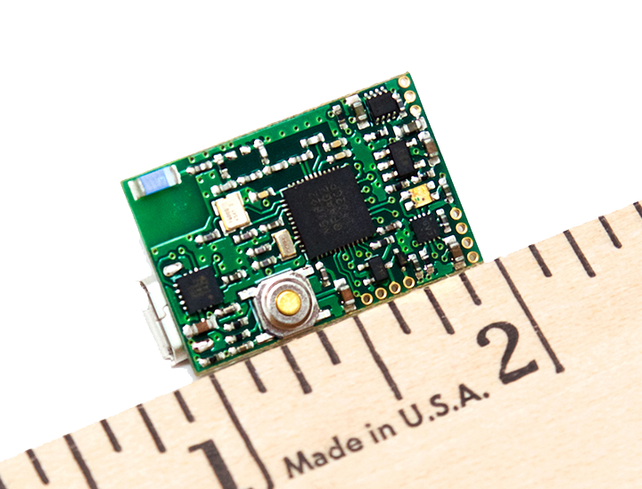
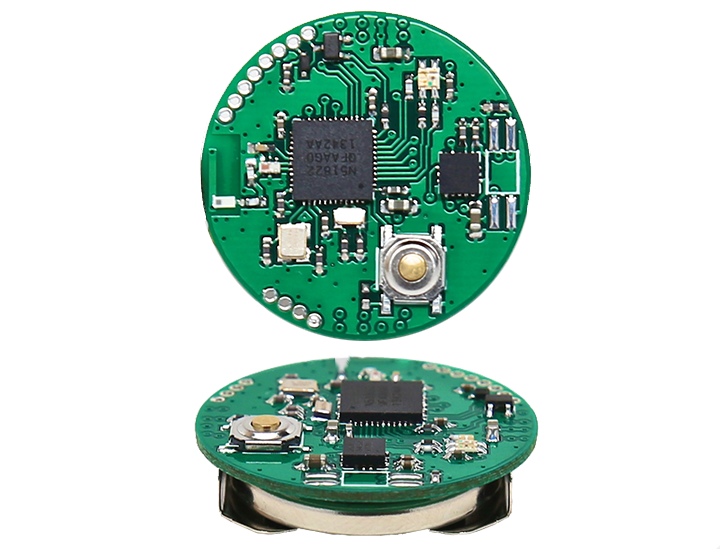

+-------+-------+
| |mwr| | |mwc| |
+=======+=======+
|       |       |
+-------+-------+

They had iOS, Android and C++ APIs.

Guess if they had Python connectors?

.. note::

	During prototype stage, I backed two other projects on Kickstarter. By the time the previous sensor rig project was done these BLE boards arrived in the mail.

	Guess if they had a Python conectors?

----

PyMetaWear
==========

|githubsmall| hbldh/pymetawear

This one is currently ongoing, so I cannot say very much about the unexpected output yet.

**Desired output:** Python client for MetaWear boards.

**Unexpected output:** 

	* Will probably yield at least one pull request to Python GATT communication libraries.

.. note::

	hbldh/pymetawear

	This one is currently ongoing, so I cannot say very much about the unexpected output yet.

	Desired output: Python client for MetaWear boards.

	Unexpected output: Will probably yield at least one pull request to Python GATT communication libraries.

----

:class: center-slide

Just one more project, ok?
==========================

----

.. note::

	I play the violin. 

	I joined a folk music association in 2012.

	I became treasurer immediately...

	As I went deeper into the paperwork of the association I found that it held massive 
	amounts of material (sheet music, member publications, paper clippings, audio interviews, 
	video recordings, photos etc.) that no one benefitted from in their current state.

	As a believer in online availability for all things I started thinking...

I play the violin. 

I joined a local folk music association in 2012.

I became treasurer immediately...

As I went deeper into the paperwork of the association I found that it held massive 
amounts of material (sheet music, member publications, paper clippings, audio interviews, 
video recordings, photos etc.) that no one benefitted from in their current state.

As a believer in online availability for all things I started thinking...

----

Archive, version 1
==================

* Flask web app deployed at Google App Engine.
* Stored data in MongoDB.
* Served files from Dropbox.
* Contained 1.5 GB of scanned material.

**Desired output:** Constantly available archive, running free of charge.

**Unexpected output:** 
	
	* 2 accepted pull requests to `Flask-PyMongo <https://github.com/dcrosta/flask-pymongo>`_
	* 2 MongoDB certifications!
	* |githubmini| ``hbldh/MongoLab-REST-GAE`` - REST API client for GAE
	* Notice the past tense in the list above?

.. note ::

	* Flask web app deployed at Google App Engine.
	* Stored data in MongoDB.
	* Served files from Dropbox.
	* Contained 1.5 GB of scanned material.

	Constantly available archive, running free of charge.

	Unexpected output: 
		
		* 2 accepted pull requests to `Flask-PyMongo <https://github.com/dcrosta/flask-pymongo>`_
		* 2 MongoDB certifications!
		* ``hbldh/MongoLab-REST-GAE`` - REST API client for GAE
		* Notice the past tense in the list above?

----

Archive, version 2
==================

* Flask web app deployed at Heroku.
* Storing data in MongoDB.
* Serving files from Dropbox.
* Serving images from Cloudinary.
* Text searching in OCR-parsed material dating back to 1929.
* Contains 2.5 GB of scanned material.

**Desired output:** Constantly available archive, still running free of charge.

**Unexpected output:** 
	
	* PDF manipulation GUI.
	* Lots of hugs from older members of the association. (Ok, not really unexpected.)

.. note::

	* Flask web app deployed at Heroku.
	* Storing data in MongoDB.
	* Serving files from Dropbox.
	* Serving images from Cloudinary.
	* Text searching in OCR-parsed material dating back to 1929.
	* Contains 2.5 GB of scanned material.

	Constantly available archive, still running free of charge.

	Unexpected output:
		
		* PDF manipulation GUI.
		* Lots of hugs from older members of the association. (Ok, not really unexpected.)	

----

Other projects during the same time
===================================

|githubmini| ``hbldh/skboost`` - Multiple Instance Learning boosting algorithm.

|githubmini| ``hbldh/b2ac`` - Ellipse fitting implemented in fixed point C!

``nExtClient`` - Python client for Nordnet Bank's data API service. Not open sourced yet, needs unit tests first.

.. note::

	``hbldh/skboost`` - Multiple Instance Learning boosting algorithm.

	``hbldh/b2ac`` - Ellipse fitting implemented in fixed point C!

	``nExtClient`` - Python client for Nordnet Bank's data API service. Not open sourced yet, needs unit tests first.

----

:class: center-slide

Wait, was this presentation just a very long humble brag?
=========================================================

----

:class: center-slide

Well, yes, in a way.
====================

----

:class: center-slide

It is also a love song to spare time coding!
============================================

None of the packages I have described are in any danger of becoming household Python packages. 
Do I really believe that they are worth presenting to others?

Can it be justified to put 200+ hours into a web archive benefitting ~200 people?

.. note::

	None of the packages I have described are in any danger of becoming household Python packages. 
	Do I really believe that they are worth presenting to others?

	Can it be justified to put 200+ hours into a web archive benefitting ~200 people, which nobody had ordered and paid for?

----

:class: center-slide

YES!
====

----

:class: center-slide

So, what is the point of all these pointless projects?
======================================================

.. note::

	Common to the projects I have talked about here is that they could almost always have been solved simpler:

	- Sudoku: Why build an own OCR solution when it is already readily available?
	- Sensor: Building clients for sensor rigs, why?
	- Archive: You weren't paid, why not just post the scanned material to a Wordpress-page?

	These questions and other ones like

	- Why didn't you use package X to do this instead? 
	- Did you not know that it is wrong to parse html with regular expressions?

	are the natural enemies of the pointless project.

	The self-imposed boundaries and restrictions are a vital part of the pointless projects'; most often they 
	make the difference between a pointless project with beneficial fallout and a pointless project that merely provides some experience.

----

:class: center-slide

.. note::
	
	As per usual, it is the journey itself that is the actual point, here illustrated by the poem The Road Not Taken by Robert Frost.

	It is a very common conclusion, but one worth iterating once more time.

	* It is The Road less traveled by that yields the unexpected,
	* that initiates the odyssey of code that takes you to new places, 
	* that enables you to make glorious mistakes.

	The initial ideas of the projects intermingle and spawn new ones, which opens your world to the unexpected.

	[Stolen from Neil Gaimans "Make Good Art" speech]
	The things I did because I was exited and wanted to see them exist in reality have never let me down and I have never regretted the time I spent on any of them.

::

	I shall be telling this with a sigh 
	Somewhere ages and ages hence: 
	Two roads diverged in a wood, and I— 
	I took the one less traveled by, 
	And that has made all the difference.

*The Road Not Taken*, Robert Frost

----

:class: center-slide

Thank you for listening!
========================

